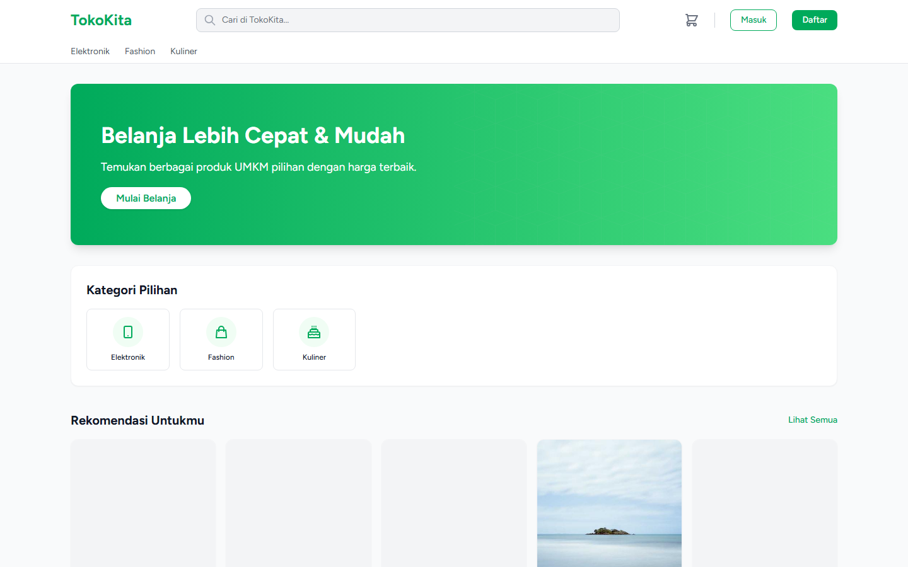
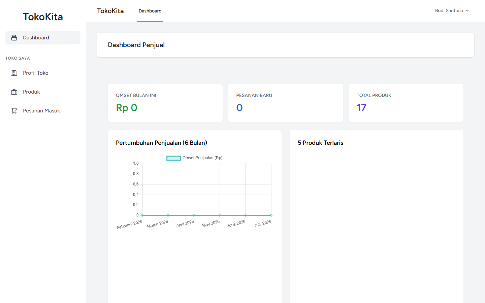
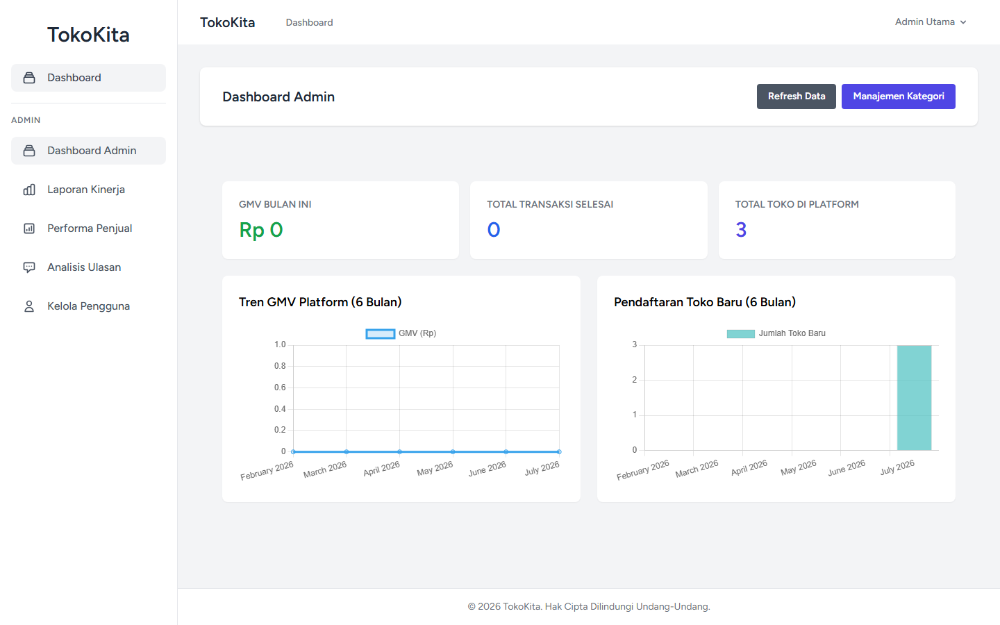

# TokoKita (Toko UMKM App)

TokoKita adalah platform aplikasi web e-commerce yang dirancang khusus untuk mendukung Usaha Mikro, Kecil, dan Menengah (UMKM). Aplikasi ini memfasilitasi pemilik usaha untuk membuka toko online, memasarkan produk mereka, dan mengelola operasional bisnis secara efisien. Bagi masyarakat umum, platform ini memberikan kemudahan untuk mencari dan membeli produk-produk lokal dari berbagai UMKM secara aman dan nyaman.

## Daftar Fitur

### Pembeli (Customer)
- **Manajemen Akun:** Registrasi, login, dan manajemen profil.
- **Eksplorasi Produk:** Pencarian produk dan filter.
- **Keranjang Belanja:** Menambahkan produk ke keranjang.
- **Checkout & Pembayaran:** Proses pesanan.
- **Riwayat Pesanan:** Melacak status pesanan.
- **Ulasan:** Memberikan ulasan dan rating produk.

### Penjual (Pemilik Toko / UMKM)
- **Manajemen Toko:** Profil toko, alamat, dan logo.
- **Katalog Produk:** Menambah, mengubah, dan menghapus produk (stok, harga, dll).
- **Manajemen Pesanan:** Memproses pesanan dari menunggu pembayaran hingga selesai.
- **Laporan Kinerja:** Analisis penjualan, laba rugi, dan produk terlaris.

### Admin Sistem
- **Dashboard:** Ringkasan statistik platform.
- **Manajemen Pengguna:** Verifikasi toko dan pemblokiran akun.
- **Manajemen Kategori:** Mengatur kategori produk global.

## Tumpukan Teknologi (Tech Stack)

- **Backend:** PHP 8.1+, Laravel 10
- **Database:** MySQL / MariaDB
- **Frontend:** Blade Templating, Tailwind CSS, Alpine.js
- **Testing:** Playwright (E2E)

## Langkah Instalasi

Ikuti langkah-langkah di bawah ini untuk menginstal dan menjalankan aplikasi secara lokal:

1. **Clone repositori**
   ```bash
   git clone <url-repo>
   cd toko-umkm-app
   ```

2. **Instal dependensi PHP**
   ```bash
   composer install
   ```

3. **Instal dependensi Node.js**
   ```bash
   npm install
   ```

4. **Konfigurasi Environment**
   Salin file `.env.example` menjadi `.env` dan atur konfigurasi database Anda.
   ```bash
   cp .env.example .env
   php artisan key:generate
   ```

5. **Migrasi dan Seeding Database**
   ```bash
   php artisan migrate --seed
   ```

6. **Build Aset Frontend**
   ```bash
   npm run build
   ```

7. **Jalankan Aplikasi**
   ```bash
   php artisan serve
   ```
   Aplikasi akan berjalan pada `http://localhost:8000` (atau gunakan domain Laragon Anda seperti `http://toko-umkm-app.test`).

## Menjalankan Test Playwright

Proyek ini dilengkapi dengan End-to-End testing menggunakan Playwright. Untuk menjalankan test, gunakan perintah berikut:

1. **Jalankan test tanpa UI (Headless)**
   ```bash
   npm run test:e2e
   ```

2. **Jalankan test dengan UI mode**
   ```bash
   npm run test:e2e:ui
   ```

## Tangkapan Layar Fitur Utama

### Halaman Pembeli (Katalog)


### Halaman Penjual (Dashboard Toko)


### Halaman Admin (Dashboard Admin)


## Informasi Penulis

- **Nama:** Muhammad Ibnu Ri'ayath Syah
- **NPM:** 2210010191
- **Program Studi:** Teknik Informatika
- **Email:** Syahibnu704@gmail.com
